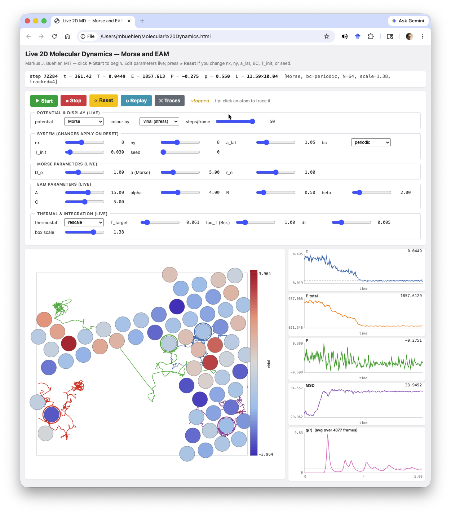
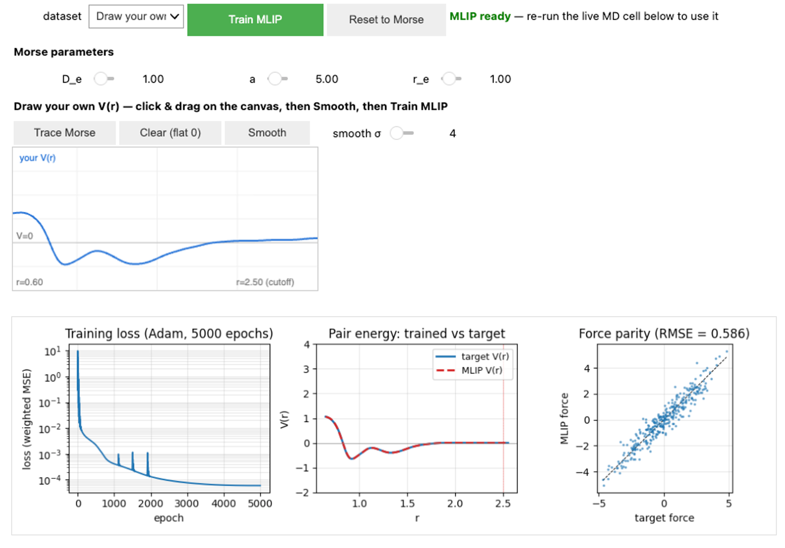
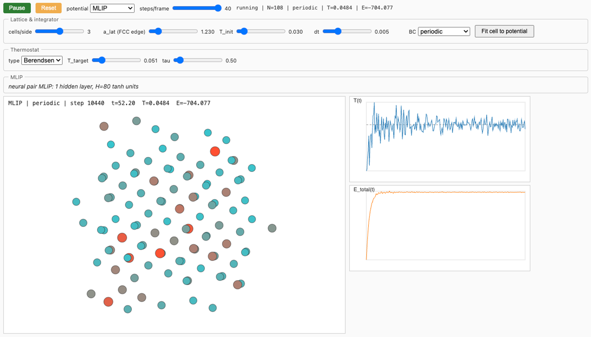

# Molecular Dynamics Modules

Interactive, from-scratch teaching tools for **molecular dynamics**. This
repository contains four self-contained modules:

- **2D MD — Morse & EAM** (`Molecular Dynamics.ipynb` + `Molecular Dynamics.html`):
  pairwise and many-body potentials, velocity Verlet, virial stress, and a live
  in-browser simulator.
  [](https://colab.research.google.com/github/lamm-mit/MolecularDynamicsModules/blob/main/Molecular%20Dynamics.ipynb)
- **3D MD with a learned potential (MLIP)** (`Molecular Dynamics MLIP.ipynb`):
  draw any pair potential, train a small neural network to imitate it
  (Adam / AdamW), and run it live in 3D.
  [](https://colab.research.google.com/github/lamm-mit/MolecularDynamicsModules/blob/main/Molecular%20Dynamics%20MLIP.ipynb)
- **2D Fracture & Mechanics** (`Fracture and Mechanics.ipynb`): pull a triangular
  lattice with an edge pre-crack to failure in Mode I / II and watch the crack
  run, with a live stress–strain curve.
  [](https://colab.research.google.com/github/lamm-mit/MolecularDynamicsModules/blob/main/Fracture%20and%20Mechanics.ipynb)
- **Phonons** (`Phonons.ipynb`): build the dynamical matrix from any potential,
  plot the phonon dispersion, and animate the eigenmodes — Morse vs. MLIP.
  [](https://colab.research.google.com/github/lamm-mit/MolecularDynamicsModules/blob/main/Phonons.ipynb)

The Fracture and Phonons modules can use the **same trained MLIP** (a default fit
is bundled; paste your own weights from the MLIP notebook) — train a potential
once, then *use* it for mechanics and vibrations.

---

## Module 1 — 2D Molecular Dynamics (Morse & EAM)

An interactive teaching tool for **2D molecular dynamics** with two interatomic
potentials (Morse and Embedded-Atom Method), built from scratch.

Includes:

- **`Molecular Dynamics.ipynb`** — a Jupyter notebook deriving the physics
  (potentials, forces, velocity Verlet, virial stress) in NumPy. Smoke tests
  energy conservation for both potentials.
- **`Molecular Dynamics.html`** — a self-contained HTML/JavaScript page that
  runs the same simulation **live in the browser at ~60 FPS** with
  click-to-tweak parameters, atom tracing, MSD/RDF, and live density control.

The notebook embeds the HTML page as an iframe in its final cell, so opening
either file gives you the live simulator. There are **no external dependencies**
for the HTML — open the file in any browser and it works offline.

> Markus J. Buehler, MIT

[](https://colab.research.google.com/github/lamm-mit/MolecularDynamicsModules/blob/main/Molecular%20Dynamics.ipynb)

Click the badge to launch the notebook in Google Colab — no local install
required. The live HTML simulator is auto-fetched from this repository on
first run, so the embedded panel in § 5 works in Colab the same way as
locally.

---

## Quick start

### Live simulator (no Python)

Double-click **`Molecular Dynamics.html`**, or:

```bash
open "Molecular Dynamics.html"          # macOS
xdg-open "Molecular Dynamics.html"      # Linux
start "Molecular Dynamics.html"         # Windows
```

Click **▶ Start**. Tweak any slider while running.

### Jupyter notebook

```bash
jupyter lab "Molecular Dynamics.ipynb"
```

Runs in JupyterLab, classic Jupyter, or VS Code's Jupyter extension. The
notebook's § 5 embeds the live HTML simulator inside an `<iframe srcdoc=...>`,
so you get the 60 FPS animation directly in the cell output.

Requirements (for the Python parts only): `numpy`, `matplotlib`, `ipywidgets`,
`jupyter`. Standard scientific-Python stack.

---



---

## What you can do

| Control | Effect |
|---|---|
| **Potential** | Switch between **Morse** ($V = D_e[1 - e^{-a(r-r_e)}]^2$) and **EAM** (Finnis–Sinclair: $E_i = -C\sqrt{\rho_i} + \tfrac12 \sum_j \phi(r_{ij})$). Switch on the fly mid-run. |
| **Lattice** | nx, ny atoms on a 2D triangular lattice; spacing $a_\text{lat}$; **periodic** or **reflecting walls** boundary conditions. |
| **Temperature** | Initial $T$, plus three thermostats: **none** (NVE), **rescale**, **Berendsen**. Live-editable target $T$. |
| **Integrator** | Velocity Verlet, live-editable $\Delta t$. |
| **Density** | A `box scale` slider rescales the box (and all positions) live. Recomputes forces, clears RDF, MSD continues with a $\text{ratio}^2$ jump. |
| **Visualisation** | Colour atoms by **KE**, **PE**, **speed**, or **virial stress** (live dropdown). |
| **Atom tracing** | Click any atom to start tracing its trajectory; click again to stop. Up to 8 traced atoms, each in a distinct colour. Trails handle PBC wraps correctly. |
| **Replay** | Scrubs through the last 400 simulation snapshots. |
| **Live time series** | Sliding-window plots of $T(t)$, total energy $E(t)$, pressure $P(t)$, **MSD** (mean-square displacement), and **g(r)** (radial distribution function, time-averaged). |

---

## Physics summary

* **Units:** reduced, with $k_B = 1$ and atom mass $m = 1$. Lengths and energies
  measured in each potential's natural scale.
* **Forces:** computed with full pairwise sums (no neighbour list — $\mathcal{O}(N^2)$
  vectorised in NumPy / inlined in JS). Fine for $N \lesssim 200$, which is
  plenty for visualisation.
* **Velocity Verlet** symplectic integrator; total energy drifts by $\sim 10^{-4}$
  over $10^3$ steps at the default $\Delta t = 0.005$.
* **Per-atom observables:** kinetic energy, potential energy, speed, virial-trace
  scalar (used as a local stress field).
* **Global observables:** temperature $T = \langle KE \rangle / N$ (2D, $k_B = 1$),
  total energy, 2D pressure $P = (2 KE + W) / (d V_\text{box})$ where $W$ is
  the pair-virial sum.
* **MSD** uses an *unwrapped* trajectory, so periodic boundary crossings don't
  cause spurious resets. Reference positions are set at Reset.
* **RDF** $g(r)$ is a time-averaged histogram of pairwise distances (minimum-image
  for periodic BCs), out to $r_\text{max} = \tfrac{1}{2}\min(L_x, L_y)$. Auto-clears
  when the density changes (box scale slider).
* **Potential conventions:** Morse is implemented in the textbook $V_A = D_e (1-e^{-a(r-r_e)})^2$
  form ($V_A \ge 0$, asymptote at $D_e$). The cohesion-comparison plot in the
  notebook uses the equivalent $V_B = V_A - D_e$ so well depths are directly
  comparable with EAM. Forces are unaffected by this constant shift.

---

## Suggested classroom experiments

* **Energy conservation.** Set `thermostat = none`. Watch the $E$ trace stay flat.
  Push $\Delta t$ past 0.015 mid-run — the integrator destabilises and $E$
  drifts. Estimate the breakdown $\Delta t$ from the Morse curvature
  $k = 2 a^2 D_e$.
* **Melting on the fly.** Equilibrate cold ($T_\text{init} = 0.02$), switch to
  Berendsen, and ramp $T_\text{target}$. Watch the hexagonal lattice break
  down — sharp peaks in g(r) broaden; MSD switches from flat (vibrations) to
  linear growth (diffusion).
* **Morse vs. EAM live.** Equilibrate as Morse, then switch the potential
  dropdown to EAM mid-run. The lattice readjusts; observe how stiffer pair
  bonds (Morse) hold the crystal more tightly than the softer many-body EAM well.
* **Surface energy.** Switch BC to `walls`, use EAM. Atoms at the walls have
  fewer neighbours $\Rightarrow$ lower $\rho_i$ $\Rightarrow$ less-negative
  $-C\sqrt{\rho_i}$ $\Rightarrow$ surface atoms are *less stable*. Colour by
  **PE** to see this directly.
* **Pressure–density isotherm.** Vary the `box scale` slider in a thermostatted
  run; record the pressure at each setting to trace out a $P(\rho)$ curve.
* **Diffusion coefficient.** In a liquid state (high $T$, Berendsen), the MSD
  slope gives $D = \text{slope} / (2 d)$ where $d = 2$.
* **Connection to ML potentials.** Note that every quantity the panel displays —
  per-atom energy, force, stress — is exactly what modern neural-network
  interatomic potentials (GAP, ACE, NEP, MACE, Allegro, …) are trained on.

---

## Implementation notes

The HTML file is **pure vanilla JavaScript** — no React, no Vue, no D3, no
jQuery, no bundler. About 1000 lines of HTML + CSS + JS:

* Physics functions (`computeForcesMorse`, `computeForcesEAM`, `step`, …)
* `requestAnimationFrame` animation loop
* Plain `<canvas>` rendering with the Agg-equivalent 2D context
* `<input type="range">` sliders + `<select>` dropdowns wired with `addEventListener`

The notebook iframe embeds the page via `<iframe srcdoc="…">`, so the simulation
runs in an isolated browsing context inside the cell — no comm channel, no
widget-render round-trip, identical 60 FPS performance whether the page is
opened standalone or inside the notebook.

---

## Module 2 — 3D MD with a learned interatomic potential (MLIP)

[](https://colab.research.google.com/github/lamm-mit/MolecularDynamicsModules/blob/main/Molecular%20Dynamics%20MLIP.ipynb)

**`Molecular Dynamics MLIP.ipynb`** is a self-contained, pedagogical notebook that
trains a small **machine-learned interatomic potential (MLIP)** — a neural network —
and uses it to drive a live **3D** molecular-dynamics simulation. You choose the
target physics, train the network to imitate it, then watch the trained potential
run a crystal in real time.

### Pick the potential to learn

- **Morse** — the analytic Morse pair potential with adjustable $D_e$, $a$, $r_e$.
- **Draw your own** — sketch *any* $V(r)$ freehand with the mouse on a canvas
  (`ipycanvas`), then smooth it.
- **Upload CSV** — load a custom $V(r)$ from a two-column `r, V` file.

### The neural network

A one-hidden-layer tanh MLP,
$V_\theta(r) = \big[\,b + \sum_j c_j \tanh(w_j r + b_j)\,\big]\,f_c(r)$, applied per
pair so the total energy is $E = \sum_{i<j} V_\theta(r_{ij})$ and the forces are its
analytic derivative (always consistent with the energy). Train it with:

- **Adam / AdamW** — full neural-network training in **PyTorch** with autograd (the
  $dV/dr$ force term uses double-backprop); watch the loss fall over epochs.
- **CG (fast)** — freezes the hidden layer and solves the (then linear) output layer
  exactly, as a crisp reference fit.

You control the optimizer, learning rate, epochs, number of datapoints, hidden
width, and regularization. The diagnostics plot the training **loss vs. epoch**, the
**trained-vs-target $V(r)$**, and a **force-parity** scatter.


### Live 3D simulator

The final cell embeds a standalone HTML/JavaScript panel (`<iframe srcdoc=…>`) that
runs the MD loop in the browser:

- **FCC lattice** — the stable close-packed ground state is used as a starting configuration; the cell size auto-fits to
  the potential's zero-pressure spacing.
- Potentials: **Morse**, **Custom** (your drawn/target curve), or the trained
  **MLIP**.
- **Periodic** or **reflecting-wall** boundary conditions, three thermostats, live
  temperature/energy plots, and drag-to-rotate 3D rendering.


### Requirements

`numpy`, `scipy`, `matplotlib`, `ipywidgets`, `ipycanvas`, and `torch` (for the
Adam / AdamW training). Launch it in Colab with the badge above — no local install
required.

> Markus J. Buehler, MIT

---

## Module 3 — 2D Fracture & Mechanics

[](https://colab.research.google.com/github/lamm-mit/MolecularDynamicsModules/blob/main/Fracture%20and%20Mechanics.ipynb)

**`Fracture and Mechanics.ipynb`** loads a 2D triangular lattice with a sharp
**edge pre-crack** until it breaks — all in a real-time `<iframe srcdoc=…>` panel.

- **Loading**: **Mode I** (tension) or **Mode II** (shear) via grips pulled at a
  constant strain rate. Every atom is seeded with the matching **affine velocity
  field** so the strain is uniform and continuous from the first step (and it
  persists under NVE because uniform strain is a zero-net-force flow).
- **Controls**: specimen size (`nx, ny`), **crack length**, potential
  (**Morse** / **Lennard-Jones** / **MLIP**), Morse `a` (brittleness), temperature.
- **Colour by** potential energy, **virial stress**, coordination, kinetic energy,
  or speed; **scroll to zoom, drag to pan** the slab.
- **Large systems**: a linked-cell neighbour list makes the cost scale linearly,
  so `nx, ny` go up to 2048/side (total clamped to 40 000 for browser real-time;
  use offline MD such as LAMMPS for millions).
- **Emergent fracture**: there is no bond-breaking rule — bonds carry load through
  the pair potential and snap once pulled past the force peak, so the crack
  nucleates and runs from physics alone. A live **stress–strain** curve shows the
  elastic rise, the peak, and the drop as the crack propagates.

Verified in NumPy: forces equal $-\partial E/\partial\mathbf{x}$, Newton's third law,
NVE energy conservation, and progressive cross-plane bond breaking under load.

---

## Module 4 — Phonons

[](https://colab.research.google.com/github/lamm-mit/MolecularDynamicsModules/blob/main/Phonons.ipynb)

**`Phonons.ipynb`** computes lattice vibrations directly from a pair potential.

- **1D chain**: dynamical matrix vs. the textbook
  $\omega(k)=2\sqrt{K/m}\,|\sin(k a_0/2)|$ as a method check.
- **2D triangular lattice**: the $2\times2$ dynamical matrix $\mathbf D(\mathbf k)$,
  acoustic branches along $\Gamma\!-\!M\!-\!K\!-\!\Gamma$, with the acoustic sum rule
  ($\omega(\Gamma)=0$) satisfied exactly.
- **Morse vs. MLIP**: overlays both dispersions — a stringent test of the learned
  potential, since phonons probe the **curvature** $V''(r)$, not just the energy.
- **Interactive eigenmode animation**: pick a wavevector and branch and watch the
  atoms oscillate in that phonon, with the dispersion plotted and your $k$ marked.

---

## Files

```
Molecular Dynamics.ipynb       2D MD (Morse/EAM): physics derivation + embedded simulator
Molecular Dynamics.html        2D standalone live simulator (~45 KB, no dependencies)
Molecular Dynamics MLIP.ipynb  3D MD with a trainable neural-network potential (MLIP)
Fracture and Mechanics.ipynb   2D fracture: edge crack, Mode I/II loading, live stress-strain
Phonons.ipynb                  Phonon dispersion + eigenmode animation (Morse vs MLIP)
README.md                      This file
```

---

## License

Released under the **MIT License** — see [`LICENSE`](LICENSE) in the
repository.

## Citation

If you use this code in teaching or research, please cite:

```bibtex
@software{buehler2026md2d,
  author = {Buehler, Markus J.},
  title  = {Molecular Dynamics: A Set of Interactive Teaching Tools},
  year   = {2026},
  url    = {https://github.com/lamm-mit/MolecularDynamicsModules},
  note   = {Interactive simulator: standalone HTML/JavaScript page with companion Jupyter notebook, Morse, MLIP and other force fields}
}
```
